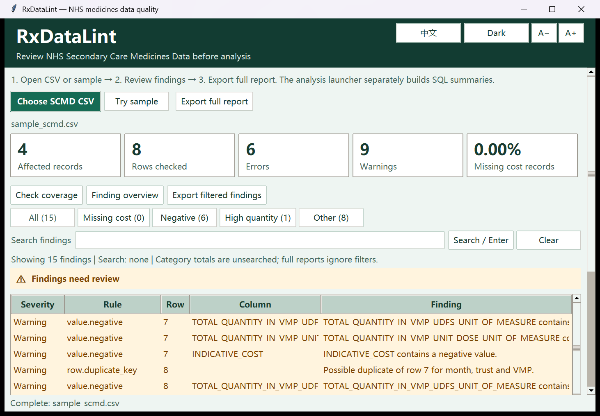

# RxDataLint

Check NHS medicines CSVs, inspect flagged records, and build local SQL summaries.

检查 NHS 药品 CSV，查看需要复核的记录，再生成本地 SQL 汇总。[完整中文说明](README.zh-CN.md)

[Windows download](https://github.com/rayexzh/rx-data-lint/releases/tag/v0.4.0-alpha.4) · [Documentation](docs/INDEX.md) · [Walkthrough](docs/DEMO_VIDEO.md)

**Current version: v0.4.0-alpha.4.** Runs locally; no paid API is needed.

## What it is for

RxDataLint works with NHSBSA Secondary Care Medicines Data (SCMD). It adds a review step before you use a downloaded CSV for analysis or Power BI reporting.

A negative quantity may be a stock adjustment. A blank cost is not zero. Repeated records can affect totals. Group findings by rule, organisation or medicine, then open the relevant source row before interpreting a summary.

It is intended for analysts working with SCMD and learners practising medicines-data analysis. It does not accept every kind of pharmaceutical dataset.



## Two tools, one workflow

| Tool | What you do | What you get |
|---|---|---|
| **Checker** | Open a SCMD CSV; review findings, search them, and inspect linked source records. | Rule explanations, coverage information, and full or filtered reports. |
| **SQL analysis** | Select the CSV and generate a new analysis snapshot. | A SQLite database, five CSV summaries, and offline English and Chinese HTML reports. |

Checks cover required columns, dates, identifiers, numeric values, candidate duplicate keys, negative values, and extreme quantities. Missing-month checks apply to combined multi-month data. Search filters findings and their linked records; it is not a search engine for every medicine in the file.

SQL summaries show monthly record counts, product costs, organisation coverage, findings by rule, and the effect of excluding negative costs. Missing and invalid costs remain distinct from zero. Quantities with different products or units are not added together.

## Try it in a few minutes

1. Download the Windows ZIP and **extract the whole folder**.
2. Open **Start-Checker.bat**, then choose **Try sample**.
3. Select **Group findings**, choose rule, organisation or medicine, then open a group and inspect a source row. Choose a full report or a report of the current filtered view.
4. Open **Start-Analysis.bat**, choose **Use sample**, then **Generate and verify**.
5. Open the generated report or inspect the CSV summaries.

The deliberately faulty sample has **8 records, 4 affected records, 6 errors and 9 warnings**. Several findings can refer to one record. This example checks that the review workflow works; it does not measure the quality of NHS data.

For a real file, use the [public-data case study](analysis/CASE_STUDY.md) and check its source and provisional status. Changing the input does not update a completed report: run the analysis again.

## What the results mean

A finding is a prompt to review, not proof that the source is wrong. Negative values can be legitimate adjustments. The extreme-quantity rule uses a transparent median-based threshold, not a clinical risk model. Normalising columns does not repair flagged records.

Indicative costs are not actual purchasing expenditure, sales or savings. A clean report does not certify clinical accuracy or regulatory compliance. Large files are processed in memory. Reference-code validation and some cross-release comparisons remain outside the current scope. See the [rules](docs/RULES.md) and [SQL metric definitions](analysis/README.md).

RxDataLint is independent of the NHS and NHSBSA. Public data retains its source licence; the software is [MIT licensed](LICENSE).

## Run from source

Python 3.10+ is required. The desktop tools use the standard library.

```powershell
python app.py
python analysis/desktop.py
```

For command-line use:

```powershell
python -m pip install -e .
rx-data-lint examples/sample_scmd.csv --output outputs/demo
```

## Further reading

- [Startup and Windows packaging](docs/WINDOWS-SUITE.md)
- [SQL queries, outputs and Power BI handoff](analysis/README.md)
- [Changes](CHANGELOG.md), [contributing](CONTRIBUTING.md) and [security](SECURITY.md)
- [Scripted usability review](docs/SIMULATED-USABILITY-REVIEW.md) and [analyst role walkthrough](docs/SIMULATED-ROLE-REVIEW-2026-10-04.md) — automated checks, not external user feedback.

The walkthrough shows an earlier interface; its recording method is documented in the video guide. [BatchScope](https://github.com/rayexzh/batchscope) is a separate project for synthetic manufacturing-quality records, with its own downloads and versions.
