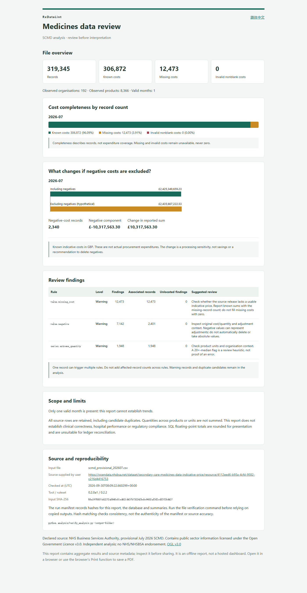

# July 2026 report example / 七月报告示例

## English

These offline HTML reports were generated from the supplied NHSBSA provisional July 2026 SCMD file (319,345 records). They contain aggregated results, review guidance and source metadata, not the original rows or SQLite database. They do not claim savings, actual procurement expenditure or compliance certification.

Download [REPORT.en.html](REPORT.en.html) and [REPORT.zh-CN.html](REPORT.zh-CN.html), save both in the same folder, and open either in a local browser. Each report is self-contained; keeping both together enables the language link. GitHub's file view shows HTML source, rather than running the report.

Reproduce a complete run using the [analysis instructions](../../README.md). This example folder is not a complete analysis output: use the verification command on newly generated full runs, not this folder. The downloadable checker EXE does not include the new analysis launcher.

Source: [NHSBSA resource](https://opendata.nhsbsa.net/dataset/secondary-care-medicines-data-indicative-price/resource/4112eed6-b93a-4cfd-9582-c216d4416753). Contains public sector information licensed under the [Open Government Licence v3.0](https://www.nationalarchives.gov.uk/doc/open-government-licence/version/3/). Source: NHS Business Services Authority. Independent analysis; no NHS/NHSBSA endorsement.

## 简体中文

本示例由提供的 NHSBSA 2026 年 7 月临时发布 SCMD 文件生成，共 319,345 条记录。报告只有汇总结果、复核建议和来源信息，不含原始记录或数据库，不声称节省金额、实际采购支出或合规认证。

下载上述两份 HTML，放在同一个文件夹，然后在本地浏览器打开；两份放在一起才能切换语言，单份也可独立查看。GitHub 文件页面显示的是 HTML 源码，不是运行后的报告。

完整复现请参考[中文分析说明](../../README.zh-CN.md)。本文件夹只是展示示例，不是完整分析输出；文件校验命令应对新生成的完整输出运行，而不是对此示例运行。已发布的检查程序 EXE 尚未包含新版分析入口。
