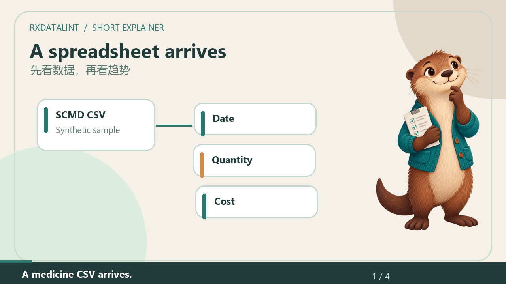

# Animated walkthrough / 动画操作视频

## Short introduction / 32 秒短动画

[Watch the otter explain the workflow / 看水獭讲解](demo/mascot/RxDataLint-Mascot-Short-v0.4.0-alpha.4.mp4) · [English subtitles](demo/mascot/English.srt) · [中文字幕](demo/mascot/Chinese.srt)

This illustrated introduction uses the bundled synthetic sample and a capture of the current desktop app. The otter and moving cards explain the review path; they are not app features. English voice is synthesized locally. A flag asks for review, not proof of a source error. / 动画使用自带模拟样例与当前桌面程序截图。水獭及卡片只用于讲解；英文旁白为本机合成。提示意味着需要复核，不等于原始数据有错。

## Longer walkthrough / 旧版长演示

[Watch/download MP4](https://github.com/rayexzh/rx-data-lint/releases/download/v0.4.0-alpha.1/RxDataLint-Animated-Walkthrough.mp4) · [Complete video pack](https://github.com/rayexzh/rx-data-lint/releases/download/v0.4.0-alpha.1/RxDataLint-Demo-Pack.zip)

A 1080p walkthrough of **v0.4.0-alpha.1**, using the bundled synthetic eight-row example. It shows sample loading, deduplicated record counts, negative-value review, record details, check coverage, search, full versus filtered exports, SQL analysis and display controls.

1080p 视频演示打开示例、记录与提示计数、负数、详情、检查覆盖、搜索、两种导出、SQL 分析及界面设置。输入为随软件提供的八行模拟样例。

## How it was made / 制作方式

Real native desktop states are edited together with animated workflow nodes, moving pointers and focus frames. These animations explain the workflow; they are not product features or an uninterrupted raw screen recording. The English voice is locally synthesized **Microsoft Zira Desktop**, not the maintainer's voice. English captions follow narration chunks; Chinese captions are chapter highlights, not a verbatim translation. There is no external music or paid model/API dependency.

实际桌面画面配流程动画、移动指示和重点框。动画用于讲解，不是软件自身功能；成片不是连续原始录屏。英文为本机合成旁白，不是作者本人发言。中文为章节要点，英文字幕按旁白段落估算时间。未加入外部音乐，不依赖付费模型/API。

[Script](demo/ENGLISH_SCRIPT.md) · [English subtitles](demo/ENGLISH_SUBTITLES.srt) · [中文要点字幕](demo/CHINESE_HIGHLIGHTS.srt) · [Video checks](demo/QUALITY_CHECK.json)

Sample: 8 rows, 4 affected records, 6 errors and 9 warnings. Missing cost counts blank cells only; the sample's malformed `unknown` cost is a numeric error, so a 0% blank-cost card is not full numeric completeness. Affected record counts are deduplicated; different rule counts overlap.

样例：8 行、4 条受影响记录、6 条错误、9 条警告。费用缺失占比只统计空白；样例 unknown 为非数值错误，所以 0% 空白不等于所有费用有效。受影响记录去重，各规则计数可能重叠。

The video demonstrates behaviour, not adoption, financial savings, clinical correctness or regulatory validation. Sources, scripts and checks remain public for review.

视频展示操作，不声称使用量、节省、临床正确性或监管认证。
