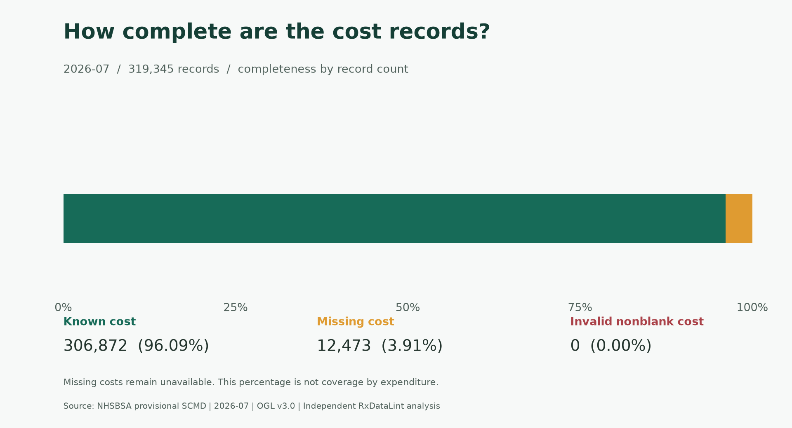
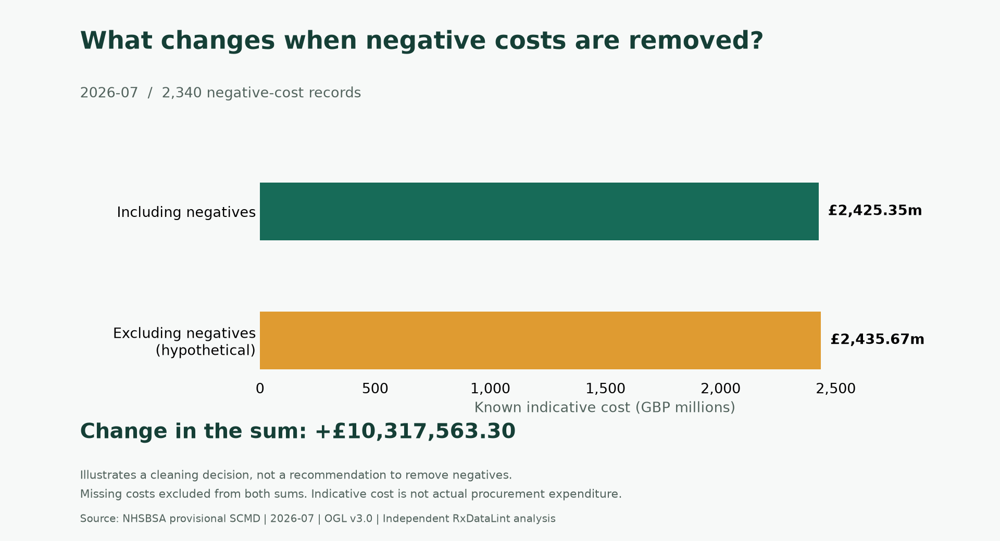

# RxDataLint + NHS Medicines Analytics

[简体中文](PORTFOLIO.zh-CN.md)

**A local medicine-data review tool and a reproducible SQL case study showing how data handling changes reported indicative costs.**

| Context | Evidence |
|---|---|
| Business question | How do missing and negative costs affect a medicines-data summary? |
| Dataset | NHSBSA provisional SCMD, July 2026; 319,345 records |
| Main result | Excluding negative costs increases the known-cost sum by £10,317,563.30 |
| Stack used | Python, SQLite, SQL, Tkinter, matplotlib; Power Query import preview verified |
| Current stage | Alpha desktop release and single-month analysis; external adoption unverified |

## Problem and implementation

A negative value can require review without automatically being an error. A missing cost cannot be interpreted as a measured zero. Deleting records or filling blanks can change both the reported total and the impression of completeness.

RxDataLint adds a bilingual desktop review step with search, finding summaries, record context and full/filtered exports. The companion database retains original cell strings, logical row numbers and review findings, with source URL, SHA-256 and version information in the run manifest.

Five SQL queries cover monthly summaries, product-cost rankings, organisation coverage, rule findings and negative-cost sensitivity. They demonstrate aggregation, CTEs, a LEFT JOIN and a ranking window function. Reproducible PNG/SVG figures communicate the results.

[Preview the bilingual offline report](../analysis/examples/202607/README.md).

## Findings

There are **12,473 missing-cost records**, giving **96.0942% completeness by record count**. This percentage does not measure expenditure coverage or establish the unknown value of missing costs.

The known net indicative cost is **£2,425,349,659.23** including negatives. Excluding **2,340 negative-cost records** gives **£2,435,667,222.53**. The **£10,317,563.30 increase** is the effect of that processing choice, not a saving or proof that all negative entries are valid.

## Verification and scope

- The complete supplied file ran through the workflow. Counts and rounded net/negative amounts were independently recalculated from the original CSV with Python Decimal and matched the exports.
- 32 desktop tests and 8 analysis tests passed locally, including report contents, file verification and launcher workflows. See GitHub Actions for the status of the current commit.
- A user-provided Power BI Desktop screenshot confirms a one-month Power Query preview with matching record, organisation, product and known-cost counts. Interactive visuals and a saved PBIX are pending.
- External deployment, production qualification, customer adoption and time savings have not been demonstrated.

This is one provisional month. It cannot establish trends, causal effects or hospital performance. Indicative cost is not actual procurement expenditure. All source rows, including candidate duplicates and warning records, are retained; business review remains necessary.

## Background and contribution

The project connects pharmaceutical quality-and-safety education with Electronic Economy studies and data work. Development used AI assistance. The project owner initiated the use case, directed iterations and personally tried the desktop application and Power Query import. The public implementation is inspectable; it does not substitute for the owner's ability to explain and maintain it.

This work demonstrates data-quality reasoning, Python processing, SQL analysis, traceability and communication. It can support a discussion of healthcare data and quality-data work; it does not establish validated GMP-system experience.

## Inspect or reproduce

- [Analysis setup and metric dictionary](../analysis/README.md)
- [Detailed bilingual case study and exact input hash](../analysis/CASE_STUDY.md)
- [Start with the monthly SQL query](../analysis/sql/01_monthly_overview.sql)
- [Power Query template](../analysis/powerbi/MonthlyReview.pq)
- [Desktop download: v0.2.0-alpha.1](https://github.com/rayexzh/rx-data-lint/releases/tag/v0.2.0-alpha.1)

Source: [NHSBSA July 2026 resource and dictionary](https://opendata.nhsbsa.net/dataset/secondary-care-medicines-data-indicative-price/resource/4112eed6-b93a-4cfd-9582-c216d4416753). Contains public sector information licensed under the [Open Government Licence v3.0](https://www.nationalarchives.gov.uk/doc/open-government-licence/version/3/). Independent project; no NHS/NHSBSA endorsement.
