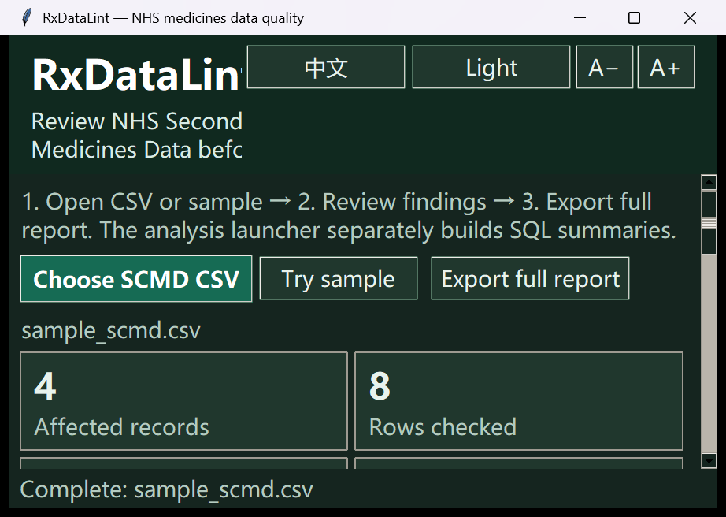
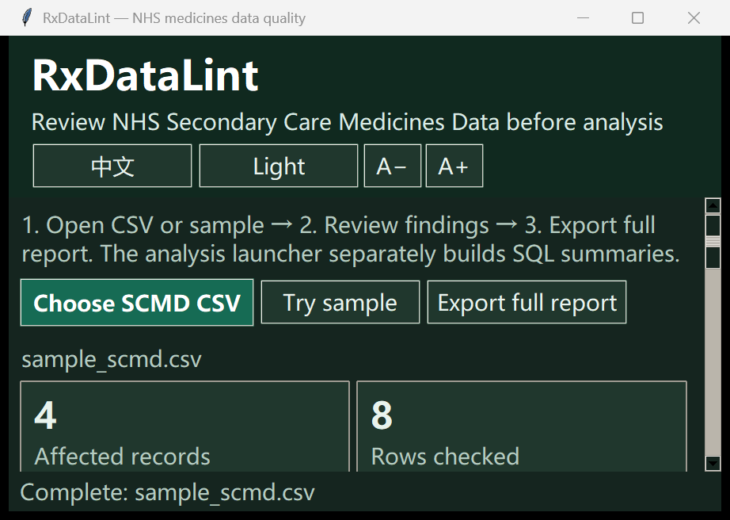

# Scripted usability review / 模拟试用与修复

On 2026-10-01, an AI-driven script exercised native Tkinter widgets, real background analysis and exported files using bundled fictional data. It invoked button commands; file pickers were programmatically selected/cancelled and error dialogs intercepted. This is source-mode software review, **not independent user research, teacher feedback or measured learning outcomes**. / 脚本操作真实界面和模拟数据，不代表真人用户反馈。

Nine workflow checks passed, including sample loading, empty search, cancellation, failed-file recovery, record context, full/filtered export reconciliation and SQL report verification. / 9 项流程检查通过。

| Observed on alpha.1 / 原问题 | Fix in alpha.2 / 修复 |
|---|---|
| 900×600, English, font 14: title cropped and the last category unmapped. / 标题与分类截断 | Header controls occupy their own row; category/export/search controls wrap. / 独立标题行与按钮换行 |
| 800×600 SQL window, font 12: workflow and header text cropped. / 分析说明截断 | Header controls are separate and long labels wrap to available width. / 分行并按实际宽度换行 |
| Editing SQL input kept the prior completed-report entry without a warning. / 新文件与旧报告混淆 | Report input/source remain explicit; edits show **not analysed yet** and retain the old report. Reverting entries clears the notice. / 标明原输入与待分析状态 |

The follow-up source checks cover minimum-window layouts, changed file/provenance, retained result identity and reverted inputs. New packaged diagnostics cover the same control/report boundaries. No calculation rules changed. / 新增有针对性的源码与 EXE 回归检查，不改变计算规则。

Display preferences still reset on restart; persistence is a future convenience improvement. / 重启记忆显示偏好暂列后续。

Before / 修复前:

After / 修复后:

Tests and screenshots demonstrate specified conditions only; they do not establish all-device usability, real adoption or clinical/regulatory correctness. / 证据只覆盖指定条件，不作使用率或合规结论。
